# Centre des sciences sur Voir l'invisible 

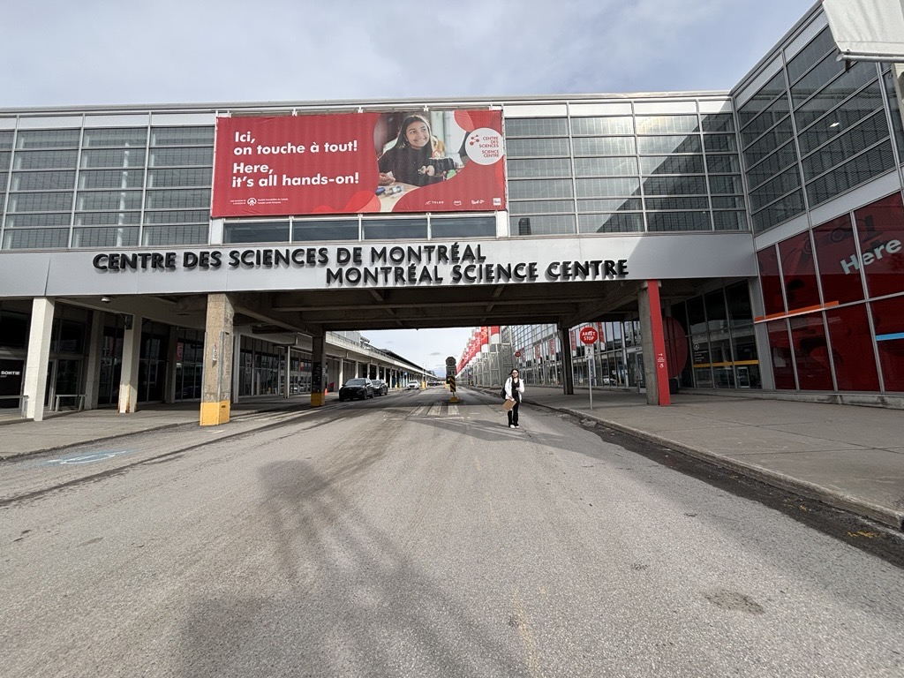

> Moi ( Alicia Castilloux) devant le Centre des sciences , photo prise par Ammar Mrini, 1 avril 2026

## La visite

Au Centre des sciences de Montréal, lors de ma visite du 1 avril 2026, l’exposition La science en grand capte immédiatement l’attention par son approche immersive et interactive. Contrairement à une exposition traditionnelle, où l’on observe à distance, ici, le visiteur est invité à expérimenter, manipuler et comprendre la science à travers des dispositifs concrets. Parmi les différentes installations proposées, l’une d’entre elles m'a piquer l'oeil : Voir l’invisible.

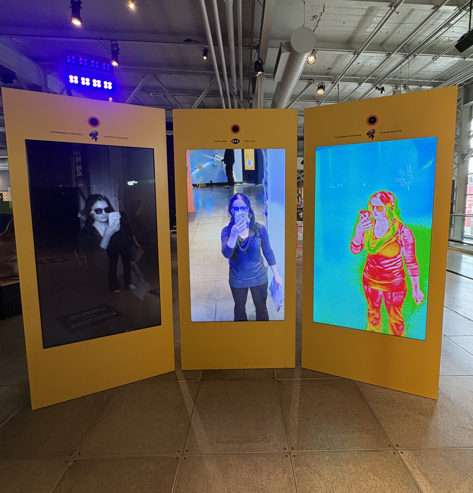

>la vue d'ensemble de la station, photo prise par Alicia Castilloux, 1 avril 2026

## Voir l'invisible

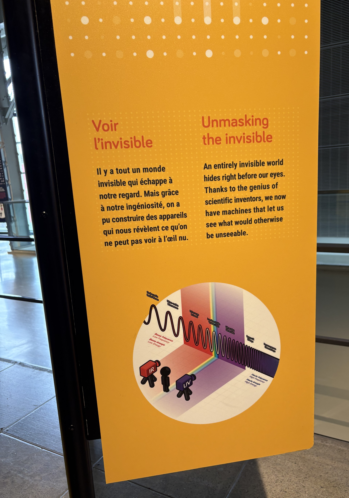

>la cartel de l'expérimentation , photo prise par Alicia Castilloux, 1 avril 2026

Ce dispositif, conçu par l’équipe du Centre des sciences, propose une expérience qui vise à rendre des phénomènes normalement invisibles à l’œil nu. Grâce à des technologies interactives, les visiteurs peuvent explorer des éléments scientifiques comme les ondes, les mouvements ou certaines réactions physiques, transformant ainsi des concepts abstraits en expériences visuelles. Donc, L’installation va dans une démarche éducative, où la compréhension passe par l’expérimentation directe sur trois écrans différentes.

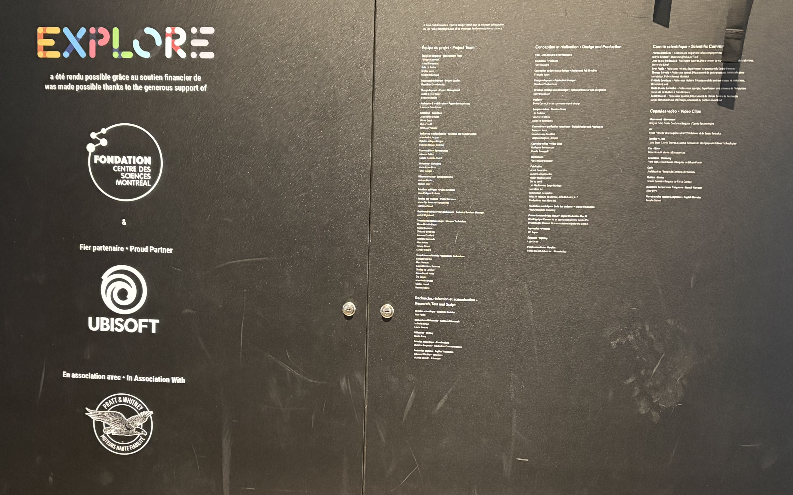

>les crédits ces intéractions , photo prise par Alicia Castilloux, 1 avril 2026

La mise en espace de Voir l’invisible est pensée pour favoriser la découverte et la circulation des visiteurs plus facilement. L’installation s’intègre dans un espace ouvert et grand. Aussi, on peut observer la station et son espace, qui facilite l’accès aux différents dispositifs.

Le dispositif repose sur plusieurs composantes techniques, comme des écrans interactifs avec des projections visuelles qui viennent avec des capteurs. Il y a trois écrans, l'un en infrarouge, l'un normal et l'un ultraviolet. De plus, une lumière bleu sur l'écran ultraviolet est utilisé pour augmenter la concrétisation de cette expérimentation. Ces éléments permettent de nous montrer des phénomènes invisibles que l'oeil nu ne peut pas voir. 

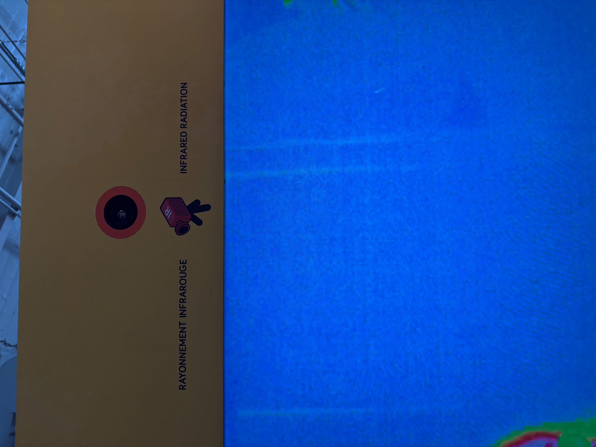

>l'écran de vision infrarouge, photo prise par Alicia Castilloux, 1 avril 2026

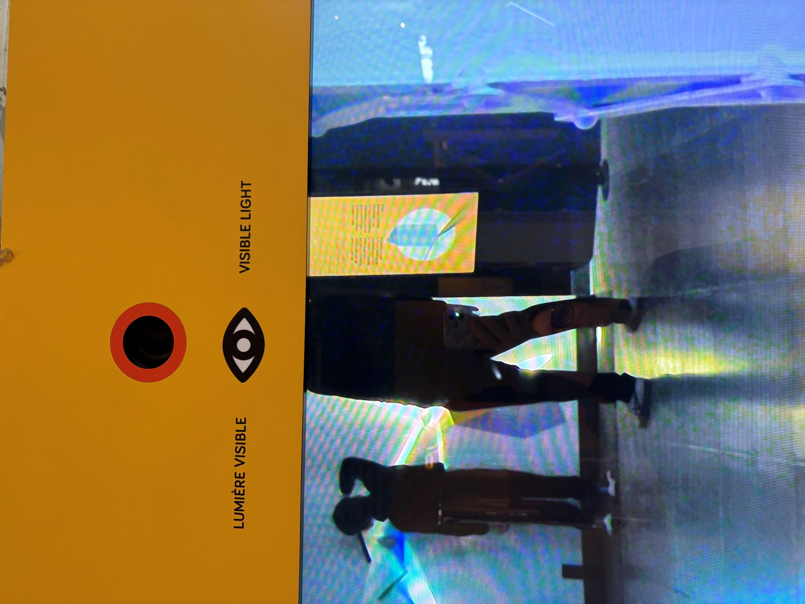

>l'écran de vision normale, photo prise par Alicia Castilloux, 1 avril 2026

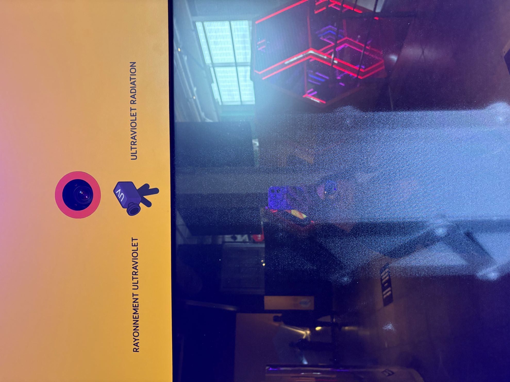

>l'écran de vision ultraviolet , photo prise par Alicia Castilloux, 1 avril 2026

Les éléments de mise en exposition jouent également un rôle essentiel dans l’efficacité du dispositif. L’éclairage est utilisé de manière à mettre en valeur les visiteurs pour l'intéraction de l'exposition, tandis que les panneaux explicatifs donnent un effet à la compréhension au trois écrans devant nous. Sur certaines photos que j’ai prises, on peut voir les composants utilisés pour capter l'attention, surtout sur les jeunes.

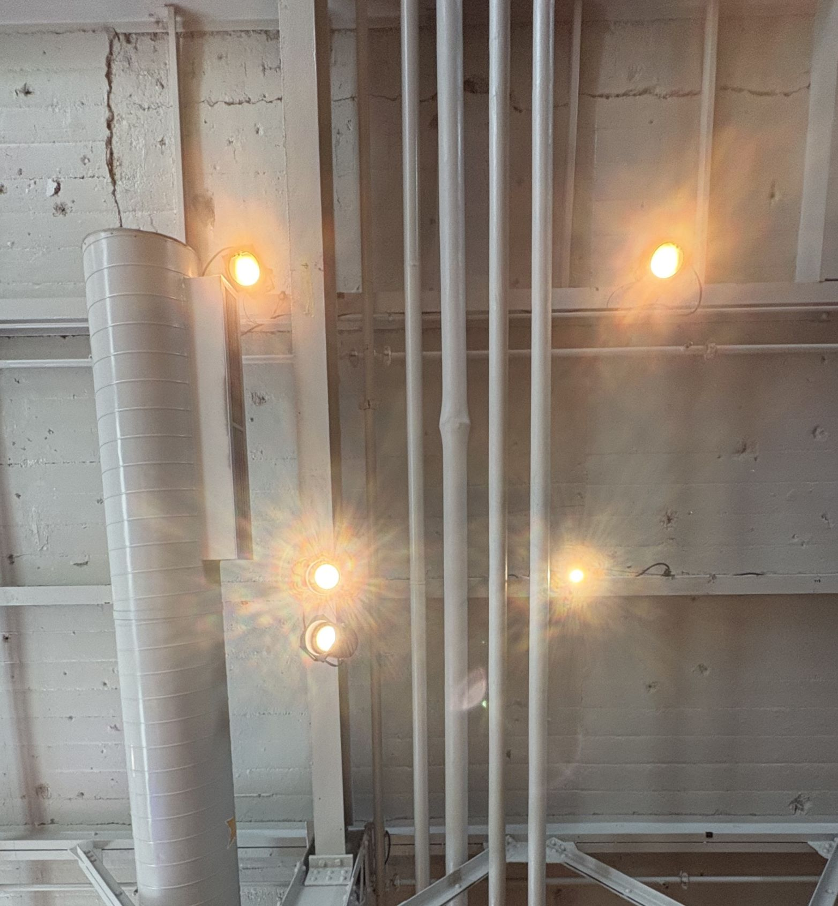

> les lumières utilisées pour mettre en valeur les visiteurs , photo prise par Alicia Castilloux, 1 avril 2026

## Mon parcours

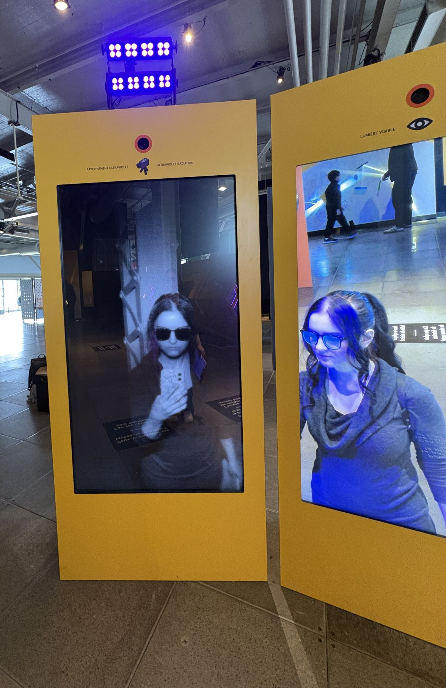

>mon essai sur l'expérience , photo prise par Alicia Castilloux, 1 avril 2026

Pour mon expérience, cette expérience a été particulière. Le fait de pouvoir interagir directement avec les dispositifs m’a permis de mieux comprendre certains phénomènes scientifiques qui, autrement, seraient restés inconnu pour ma part. J’ai apprécié le fait de se voir nous même et les questions en tant que tel pour attirer l'attention au détails, qui rend l’apprentissage mémorable.
Ce qui m’a le plus plu est la capacité de l’installation à rendre visible ce qui ne l’est pas habituellement. Cela crée un effet de surprise et de découverte qui capte l’intérêt du visiteur du début à la fin. 

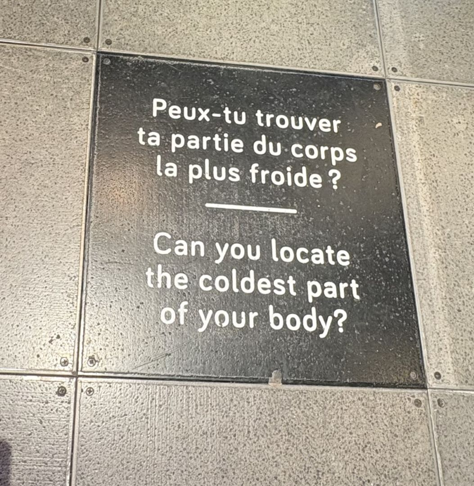

>la question à regarder sur l'écran infrarouge , photo prise par Alicia Castilloux, 1 avril 2026

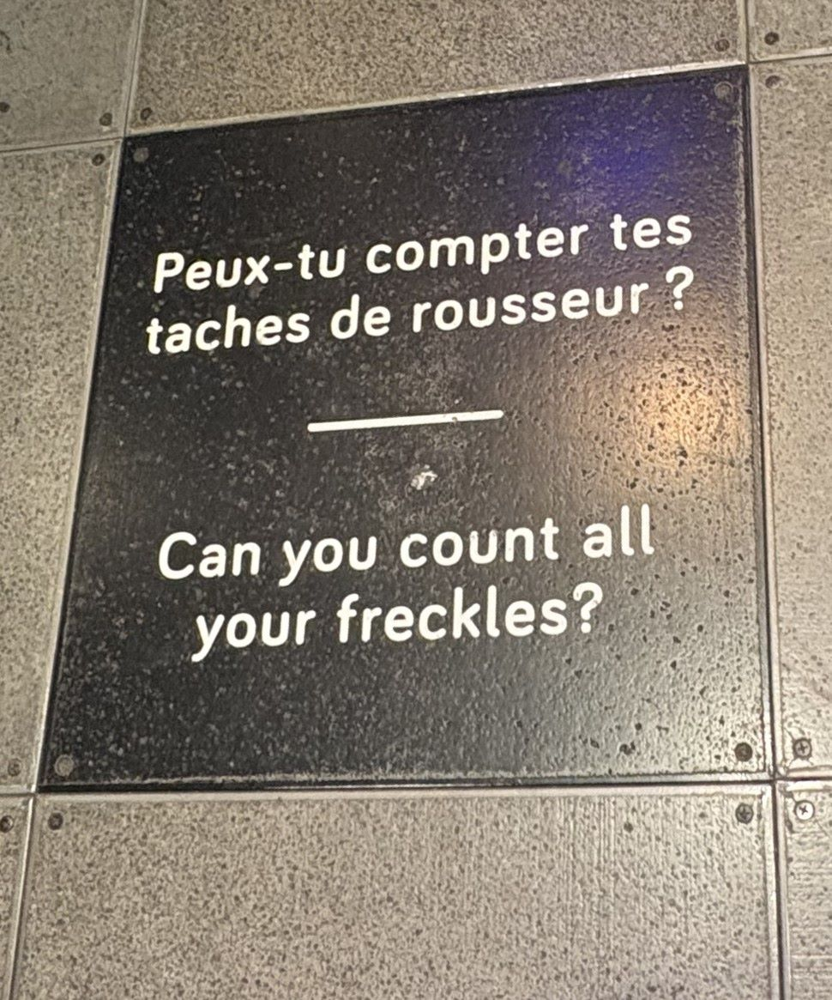

>la question à regarder sur l'écran ultraviolet, photo prise par Alicia Castilloux, 1 avril 2026

Si je devais proposer une amélioration, j’ajouteraisdes explications visuelles ou une autre forme d'activitée avec l'exposition, pour plus d'interaction avec les visiteurs.

En conclusion, Voir l’invisible, présentée dans l’exposition La science en grand, réussit à transformer des concepts scientifiques complexes en expériences accessibles et captivantes pour toutes âges. Cette installation démontre à quel point la science peut être fascinante lorsqu’elle est présentée de manière interactive, en donnant au visiteur un rôle actif dans sa propre découverte.

## référence

https://www.centredessciencesdemontreal.com/exposition-permanente/explore
