# Mission virtuelle d’exploration de Mars

## La visite 

> Moi ( Alicia Castilloux) devant le Cosmodôme de laval , photo prise Alexandre Trudel, 4 mars 2026

Ce 4 mars 2026, au Cosmodôme de laval,ce centre scientifique dédié à tous public et à la découverte de l’espace, se trouve l’activité Mission virtuelle : La planète rouge, une expérience futuriste ou ludo-éducateur transporte les visiteurs dans une visite informatique à un scénario d’exploration vers Mars.  

## La planète rouge 

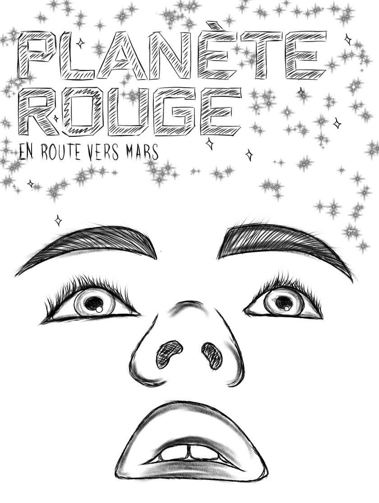

> Voici l'affiche de l'exposition que j'ai dessiné en croquis sur le site internet : https://cosmodome.org/activites-familiale/missions-virtuelles/ , dessinée par Alicia Castilloux, 4 mars 2026

Cette exposition permanente et intérieure donne la chance aux visiteurs de visiter l’univers grâce à des installations interactives et informatiques. Elle propose de vivre une simulation d’exploration vers Mars, la célèbre planète rouge. 

 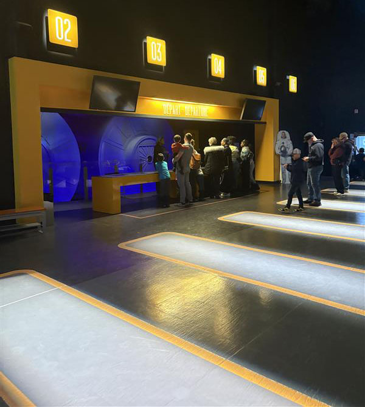 
 
> La vue d'ensemble sur le début de l'activité Mission virtuelle, photo prise par Alicia Castilloux, 4 mars 2026 ( il n'y a pas de cartel ni de photo de vue d'ensemble possible)

Ce dispositif multimédia a été fait par l’équipe scientifique du Cosmodôme, inspirée des recherches et missions spatiales menées par des agences spatiales comme la NASA et l’Agence spatiale canadienne. Le Cosmodôme a ouvert ses portes en 1994, mais les Missions virtuelles ont été développées officiellement en 2012.

 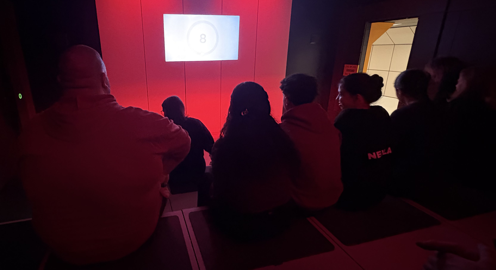 

> La deuxième salle présentée pour l'activité, photo prise par Alicia Castilloux, 4 mars 2026

L’installation est une simulation interactive et immersive, où les visiteurs deviennent les membres d’un équipage spatial. Ils doivent préparer et réaliser une mission vers Mars. L'exposition est divisé en six activités où les participants vont jouer tous les rôles cruciales d'un astronaute par exemple:  ingénieur, pilote ou spécialiste des communications. Aussi, en équipe de deux, nous allons devoir collaborer avec notre coéquipier à  analyser des données, résoudre des problèmes techniques et réussir les différentes étapes de la mission pour visite la planète rouge.

 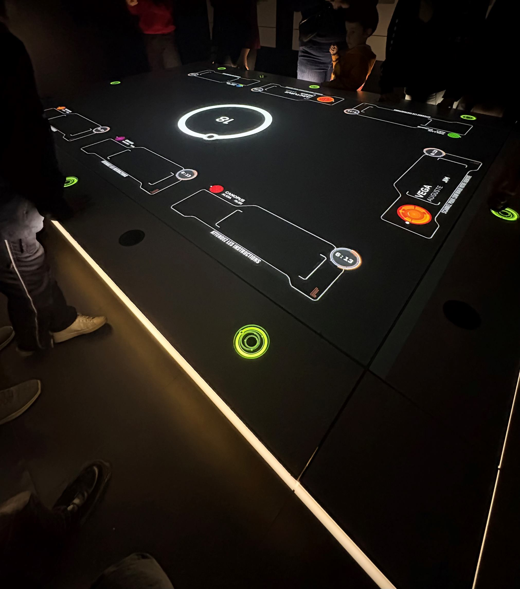 

 > La table intéractive spatiale de la cinquième salle, photo prise par Alicia Castilloux, 4 mars 2026

La mise en espace est incroyable, car chaque salle est différente, mais elles sont toutes organisées de manière à reproduire l’ambiance d’un centre de contrôle spatial. Les stations de travail sont souvent disposées face à plusieurs écrans et consoles lumineuses sur les murs ou devant nous, comme dans les salles trois, quatre et cinq. Dans d’autres salles, on nous informe d'avantage sur la planète Mars et sur ce qu’il faut savoir à son sujet, comme dans les salles un, deux et six. Pour faire passer les visiteurs d’une section de la mission à une autre, les artistes ont créé un couloir au style futuriste, composé de formes géométriques blanches et jaunes qui rappellent l’intérieur d’un vaisseau spatial. Pour faire ce projet, ils ont utilisé beaucoup de composantes multimédias pour faire ce côté réaliste comme des ordinateurs interactifs, des projections visuelles, des effets sonores et un bracelet qui était relié à un bouton vert interactif.

 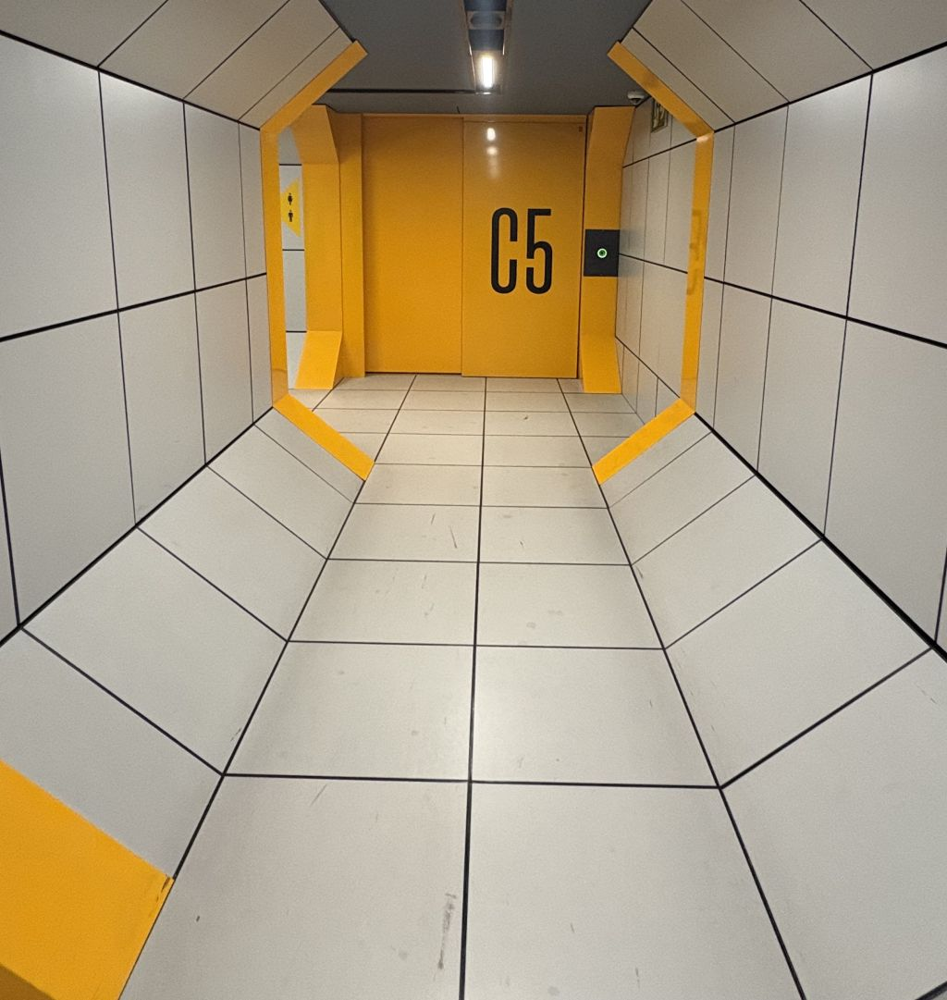 

 > Le couloir transporteur d'une porte à une autre, photo prise par Alicia Castilloux, 4 mars 2026

 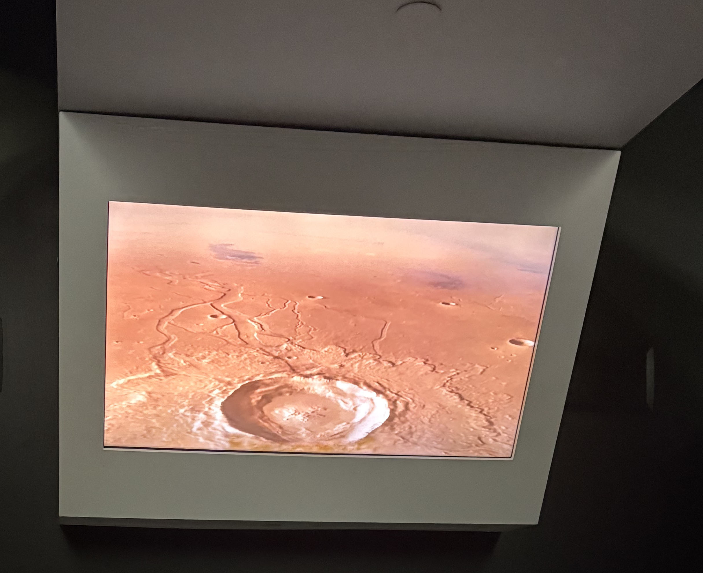 

 > L'écran informatique de la quatrième salle, photo prise par Alicia Castilloux, 4 mars 2026

 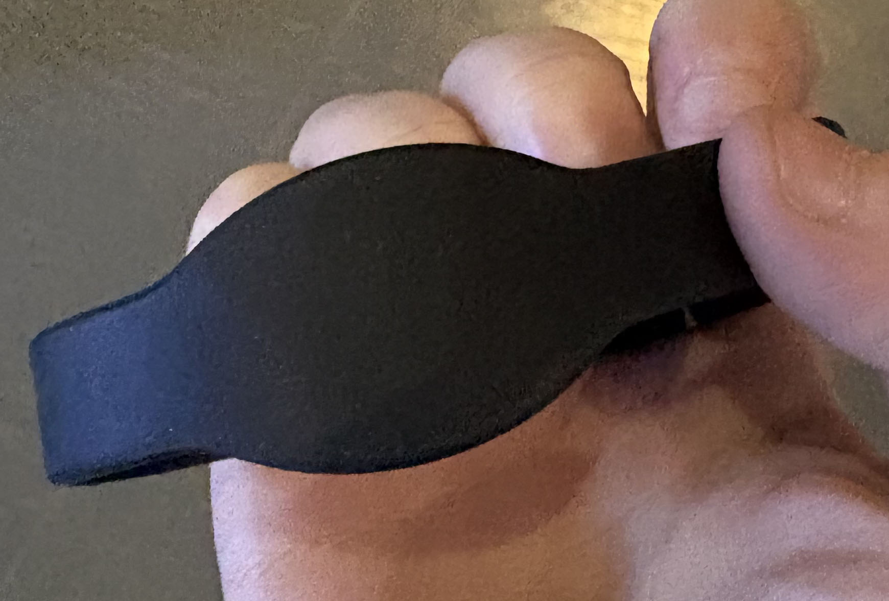 

> Un bracelet que donne les animateurs pour les intéractions envers le projet, photo prise par Alicia Castilloux,4 mars 2026

De plus, les éléments de mise en exposition jouent également un rôle important dans cette visite. L’éclairage qui fait rêver les enfants, les projections d’images spatiales et les interfaces intéractifs créent une ambiance sombre qui donne l’impression d’être seul dans l’espace. Sur une photo que j’ai prise durant l’activité, nous pouvons voir les différents jeux de lumière utilisés. On peut aussi observer les grands écrans  installés pour attirer plus facilement l’attention des joueurs, surtout les plus jeunes.

 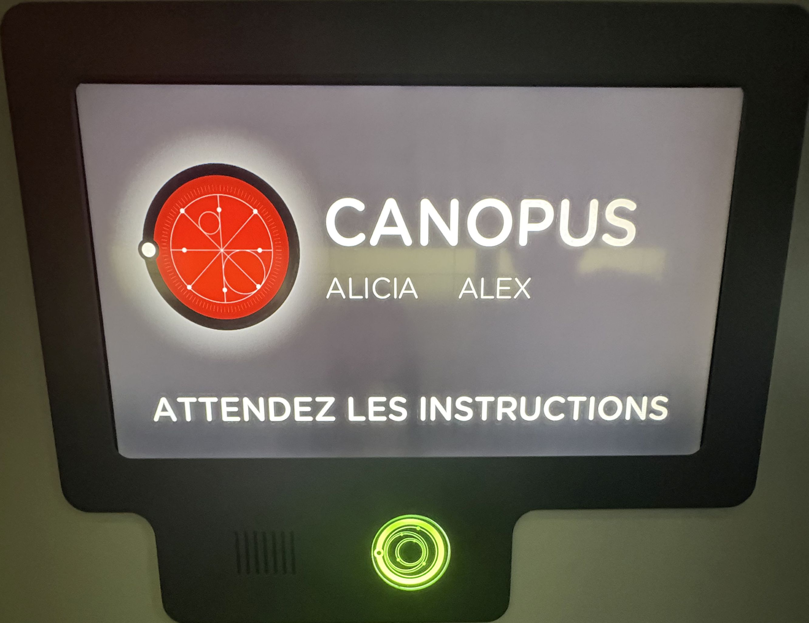 

 > L'écran de la quatrième salle, qui montre mon équipe d'aller à notre écran respectif pour l'intéraction,  photo prise par Alicia Castilloux, 4 mars 2026

 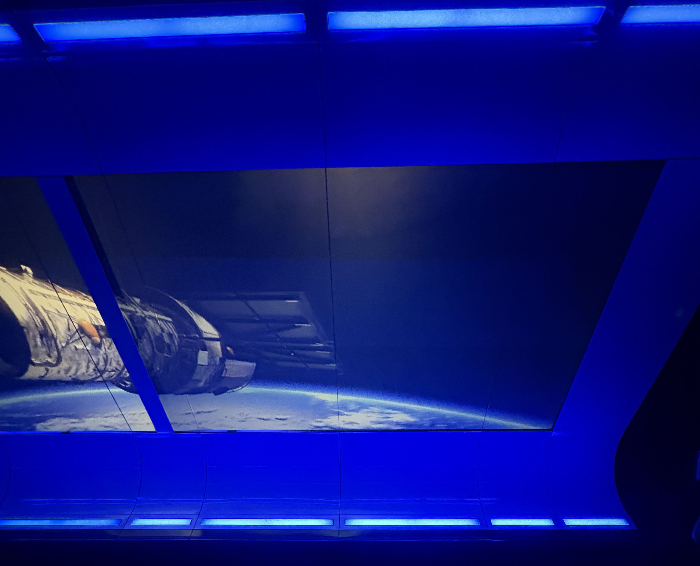

 > La grosse écran informatique de la sixième salle, photo prise par Alicia Castilloux, 4 mars 2026

 Tout ce mélange, renforce l’impression d’être dans une véritable mission spatiale importante.

 ## Mon parcours

 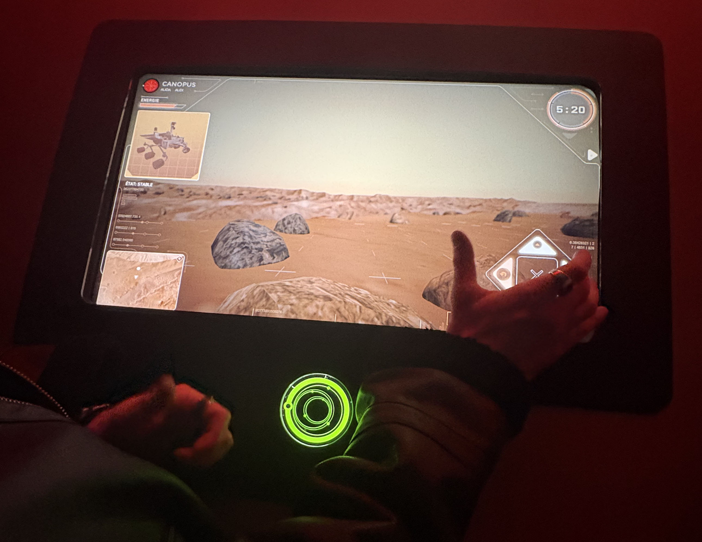 

 > Notre prochaine mission à la troisième salle, photo prise par Alicia Castilloux, 4 mars 2026

 Pour ma part, cette expérience a été amusante, car j’ai participé à ce parcours avec mon homme. Le fait de devoir résoudre des défis ensemble dans différentes salles avec un temps limité, tout en apprenant d'avantage sur cette planète rouge, j'ai trouvé le concept original et intéressante, car cela fait changement de simplement de parler d'un sujet et de rester sur place à écouter des explications.

 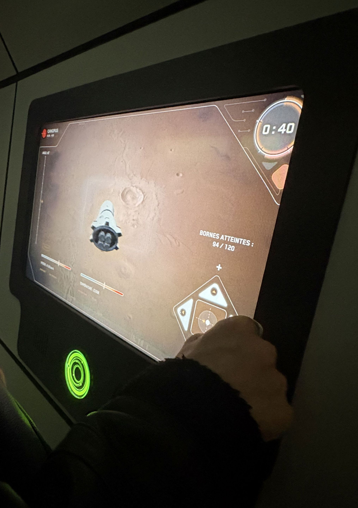 

 > Notre intéraction sur le défi de la quatrième salle, photo prise par Alicia Castilloux, 4 mars 2026

Si je devais réfléchir à un changement dans cette installation, je n'en trouverait pas. L’activité est déjà bien conçue et elle réussit à combiner l'apprentissage scientifique et divertissement dans un même projet. La Mission virtuelle donne une expérience originale qui permet de mieux comprendre les défis de l’exploration spatiale et les recherches que font les scientifiques, ils donnent une belle image à vouloir montrer à nos enfants qui seront peut-être nos futures astronautes.

## Les références

https://cosmodome.org/activites-familiale/missions-virtuelles/

https://mnj.quebec/events/missions-virtuelles/

https://gsmproject.com/fr/projets/etude-de-cas/le-cosmodome/
