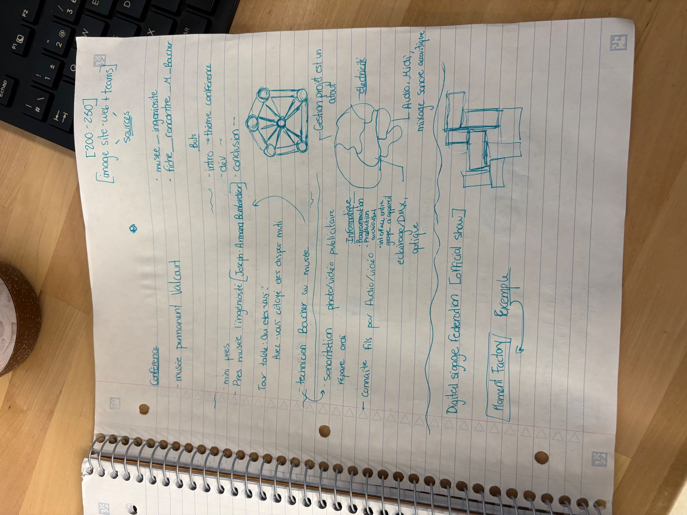
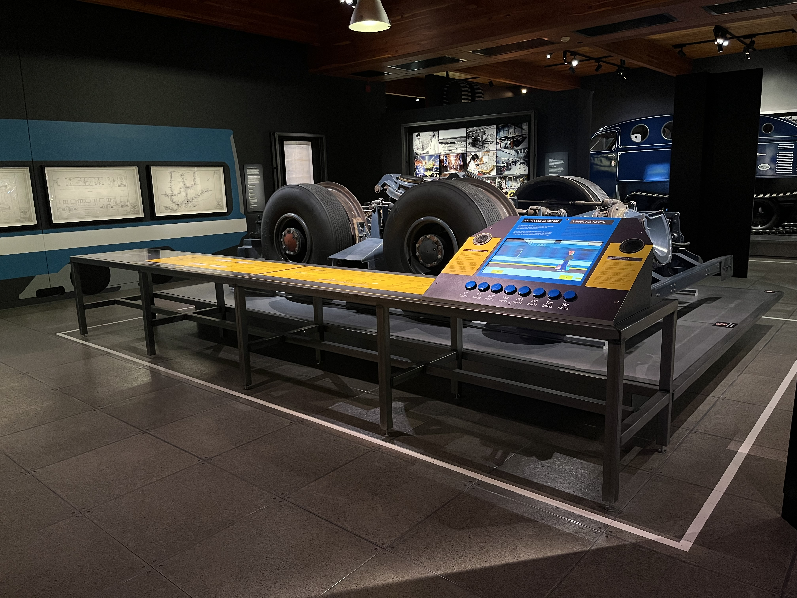
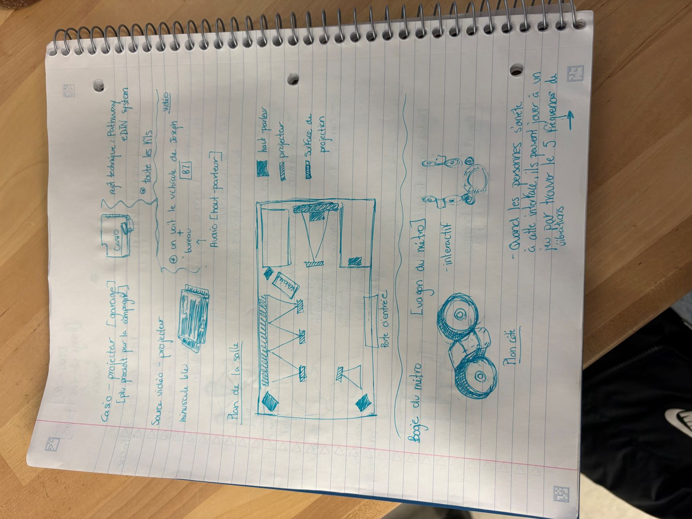
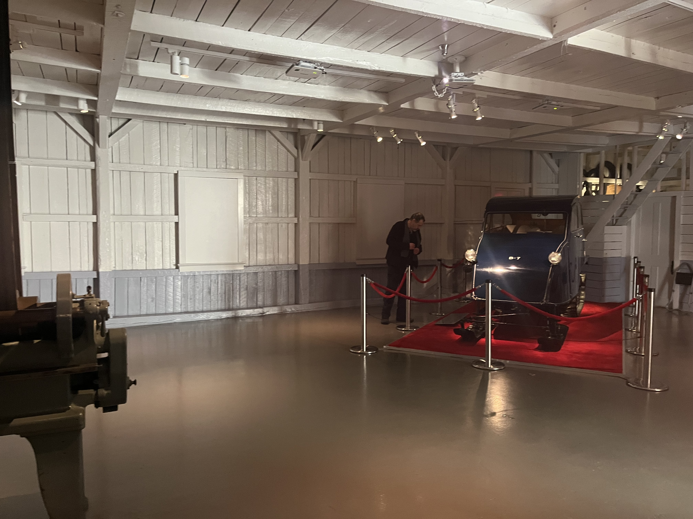

# Conférence M. Boucher

## introduction 

En ce 24 avril 2026, j’ai assisté à une conférence animée par M. Boucher, technicien au sein du musée de l’Ingéniosité J.-Armand Bombardier de Valcourt. Sa présentation avait pour but de parler de son métier polyvalent, qui touche à plusieurs domaines comme l’audio, la vidéo, l’informatique et l’éclairage. Cette conférence abordait également les différentes expositions ainsi que leurs composantes, parfois énigmatiques à nos yeux d’étudiants. De plus, La conférence a commencé par une brève introduction du conférencier, suivie d’une question générale adressée aux étudiants qui est :  Avez-vous déjà côtoyé des dispositifs multimédias ? Pour ma part, avant cette année, ma réponse aurait été négative.

>Cartel du Garage Bombardier en 1926, l'inventeur Joseph-Armand Bombardier a commencé.

> Les débuts de note sur la conférence, prise par Alicia Castilloux, 24 avril 2026

## Développement

Ensuite, M. Boucher a expliqué qu’il s’occupait autant de la sonorisation que de la production de contenu visuel, ainsi que de la maintenance des équipements. J’ai trouvé intéressant de constater à quel point son travail nécessite des compétences variées, allant de la programmation à l’acoustique. Cela montre que, dans ce domaine, avec de la motivation, il est possible de devenir très polyvalent, comme un véritable « couteau suisse ». Il nous a également présenté le plan de l’édifice ainsi que certains dispositifs du musée, comme celui du ‘bogie de métro ‘.

> Dispositif interactif du Musée de l'ingéniosité J.-Armand Bombardier

> Dessin du plan de la salle et des composants expliqués par M. Boucher, prise par Alicia Castillouz, 24 avril 2026

Dans cette installation, les visiteurs peuvent non seulement observer, mais aussi interagir avec un écran interactif, ce qui rend l’expérience à la fois active et éducative. L’écran était muni de haut-parleurs, de boutons permettant de contrôler les fréquences (hertz) et d’explications en français et en anglais. L’ensemble était relié à plusieurs 

> écran intéractif du module de Bogie de métro

## Conclusion

 En conclusion, cette conférence a été une bonne expérience sur le plan informatique, mais elle n’était pas entièrement à mon goût. Même si l’explication de son travail était intéressante et que la « visite » du musée, avec la présentation des expositions et de leurs mécanismes, était captivante, ce domaine ne correspond pas vraiment à mes intérêts personnels. Du coup, cela m’a moins donné envie d’approfondir davantage sur le sujet. 

> Salle explicatif de l'invention et de la vie de l'inventeur

329 mots

## référence 

https://museebombardier.com/expositions/
