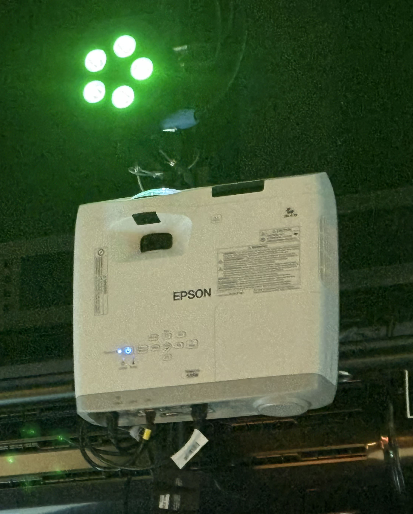
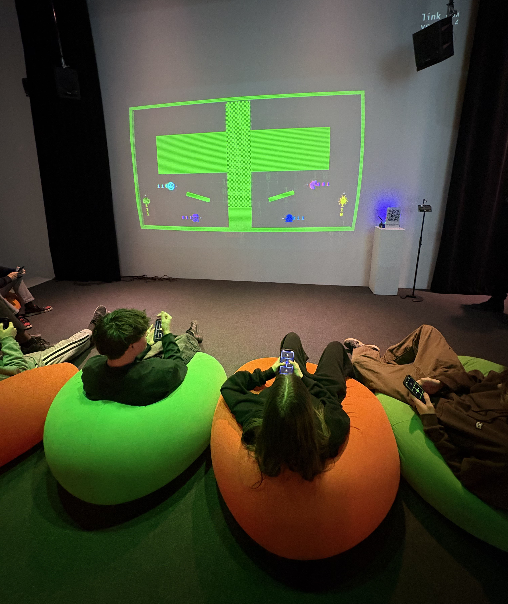

# Expositions en Tim des finisssants-tes

> Moi ( Alicia Castilloux) devant le Grand Studio , photo prise par Ammar Mrini, 17 mars 2026

## La visite 

En ce 24 février et 17 mars 2026, ont eu lieu les présentations des projets finaux de 2026, des finissants en Techniques d’intégration multimédia au Collège Montmorency. Parmi les six équipes et les différents projets présentés, une installation intérieure a particulièrement retenu mon attention : TERMINAL. Ce projet interactif s’est démarqué par son originalité et son aspect captivant. Il a été réalisé par Ahmed Kaissoumi, Radhouane Kordan, Justin Montpetit, Thearylou Lach et Jad Saloumi. 

# Terminal

> vu d'ensemble du projet Terminal , photo prise par  Alicia Castilloux , 17 mars 2026

TERMINAL propose un univers narratif inspiré du monde informatique. L’histoire repose sur un ancien système qui a été piraté par un célèbre hacker mystérieux, corrompant l’ensemble des données du réseau. Face à cette situation critique, six 'sauveurs' doivent se connecter au système afin de restaurer les données perdues. Pour y parvenir, ils doivent traverser différents secteurs du programme, chacun représentant un niveau à réparer. Cependant, le pirateur a laissé derrière lui des pièges et des obstacles afin de conserver le contrôle du système, rendant la progression plus difficile et stratégique. 

> La cartel du Terminal , photo prise par Alicia Castilloux, 17 mars 2026

TERMINAL est un jeu interactif temporaire et intérieur qui se joue en équipe, pouvant accueillir jusqu’à six joueurs. Grâce à un projecteur de marque EPSON dirigé vers un mur blanc donnant une surface pour un jeu immersive. Le jeu s’inspire du célèbre Pac-Man, notamment par son côté rétro rappelant les jeux vidéo des années 1980. On y retrouve des personnages pixelisés colorés ainsi qu’un style visuel simple. Toutefois, TERMINAL se distingue par une mécanique originale : les déplacements des joueurs laissent des traces numériques, comme des '1' et des '0', qui deviennent des obstacles pour leurs coéquipiers. L’objectif est que tous les joueurs atteignent la fin du niveau sans mourir, sinon l’équipe doit recommencer. 

> Le projecteur Epson du projet TERMINAL, photo prise par Alicia Castilloux, 17 mars 2026

Pour débuter l’interaction, les joueurs doivent scanner un code QR situé près de la projection à droite. Leur téléphone devient alors une manette de jeu, affichant une couleur, un nom de joueur ainsi qu’un bouton « prêt ». Une fois que tous les participants sont prêts. Le jeu permet également à un joueur de quitter à tout moment en fermant simplement son téléphone, ce qui démontre une certaine flexibilité dans l’expérience. 

> Le code QR pour participer à Terminal  , photo prise par Alicia Castilloux , 17 mars 2026

## L'interne et externe

L’interface des éléments de l’installation ont été soigneusement pensées afin de créer une expérience agréable pour les visiteurs. Les finissants ont aménagé avec des coussins fluauts disposés au sol, permettant aux joueurs de s’asseoir confortablement tout en participant au jeu. En avant, un grand mur projetant le jeu, captant l’attention dû à sa grandeur. L’utilisation des téléphones comme manettes est particulièrement fascinant, car elle rend le dispositif accessible sans nécessairement avoir besoin de construire d'autres équipements. De plus, un système d’éclairage met en valeur les joueurs qui jouent avec des hauts-parleurs pour les effets sonores pour une ambiance réaliste.et surtout ne pas oublier le projecteur qui assure la projection du jeu sur le mur.

> Les hauts-parleurs du projet , photo prise par Alicia Castilloux , 24 février 2026

> Les coussins du projet , photo prise par Alicia Castilloux , 24 février 2026

## Mon expérience

Personnellement, j’ai beaucoup apprécié mon expérience avec ce jeu interactif. Dès ma connexion en scannant le code QR, je me suis installée sur les coussins et j’ai vu apparaître le nom « ÉCHO » sur mon téléphone ainsi que sur l’écran principal. En attendant que tous les joueurs soient prêts, j’ai observé les autres participants, identifiés par des noms comme Alpha ou Beta, accompagnés d’un indicateur « prêt » en vert ou « pas prêt » en rouge. Cependant, avant le début du premier niveau, j’ai remarqué qu’il n’y avait pas d’explications sur le fonctionnement du jeu ou l’utilisation des contrôles, ce qui nous a obligés à apprendre par nous-mêmes. 

Au début, mes coéquipiers et moi avons eu de la difficulté à comprendre les mécaniques du jeu. Nous nous foncions souvent dedans ou contre les murs, ce qui a causé quelques frustrations. De plus, comme les personnages avaient une forme presque similaire, il était parfois difficile de se distinguer uniquement par la couleur. Cependant, après plusieurs essais, nous avons commencé à mieux communiquer, en identifiant nos couleurs et nos positions. Peu à peu, notre coordination s’est améliorée et nous avons réussi à progresser dans les niveaux. À la fin, nous avions eu l’impression d'être le maître du jeu, ce qui rendait l’expérience encore plus satisfaisante. 

> Le téléphone devenu la manette pour le jeu , capture d'écran prise par Alicia Castilloux , 24 février 2026

## Conclusion

Pour ce projet, si je devais proposer des améliorations, elles concerneraient principalement les niveaux du jeu. Avant même de commencer le premier niveau, il serait pertinent d’ajouter des instructions claires ainsi qu’une explication des commandes. Cela permettrait aux joueurs de mieux comprendre le fonctionnement dès le départ et rendrait le jeu plus accessible et flexible, surtout pour les nouveaux utilisateurs.

Ensuite, j’aurais trouvé intéressant d’intégrer, par exemple, un combat de boss à chaque dixième niveau. Ces boss pourraient représenter des virus informatiques, ce qui ferait davantage de sens avec l’univers du jeu. Plus les niveaux avanceraient, plus ces virus deviendraient imposants,fluauts et dangereux, ce qui ajouterait un défi progressif. Ce type d’évolution apporterait un sentiment de nouveauté et donnerait aux joueurs une motivation supplémentaire pour continuer. Cela créerait aussi une forme de récompense pour leur persévérance et leur patience.

De manière générale, à l’extérieur du jeu, je trouve que l’aspect décoratif et chaleureux de l’installation n’était pas absolument nécessaire au fonctionnement du jeu. Toutefois, ce n’est pas un élément négatif, au contraire, cela reste un ajout agréable qui améliore le confort et l’expérience des joueurs.

En conclusion, je pense que ce jeu possède un très bon potentiel. Il mérite d’être expérimenté dans son ensemble, car il reflète un travail sérieux, bien réfléchi et bien développé de la part de l’équipe.

 

> le projet avec des essayeurs , photo prise par Alicia Castilloux , 17 mars 2026
> 
---

# Les références

https://pythons-5.github.io/Terminal/#/
