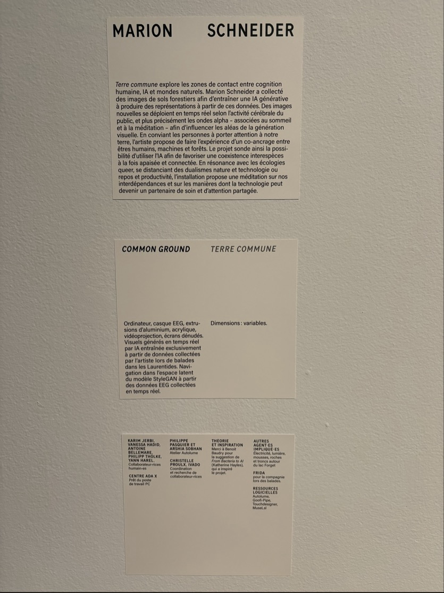
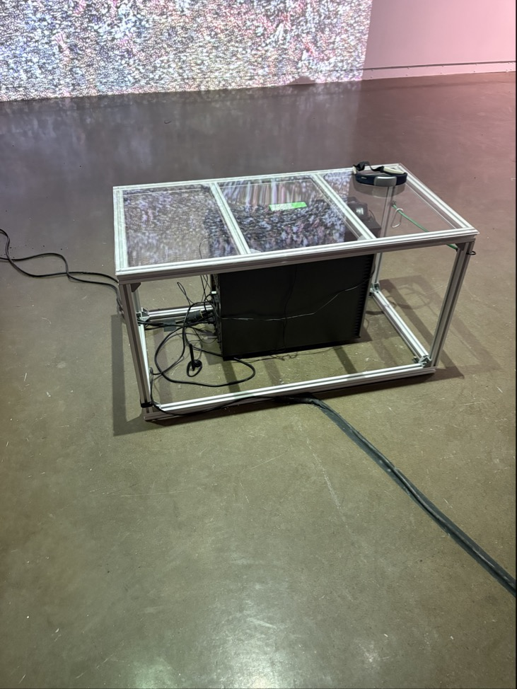
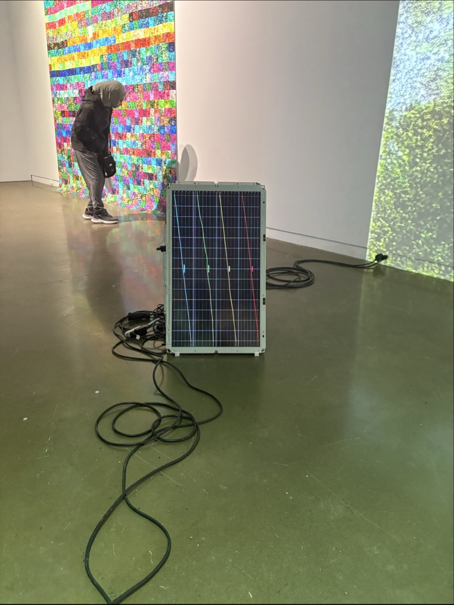
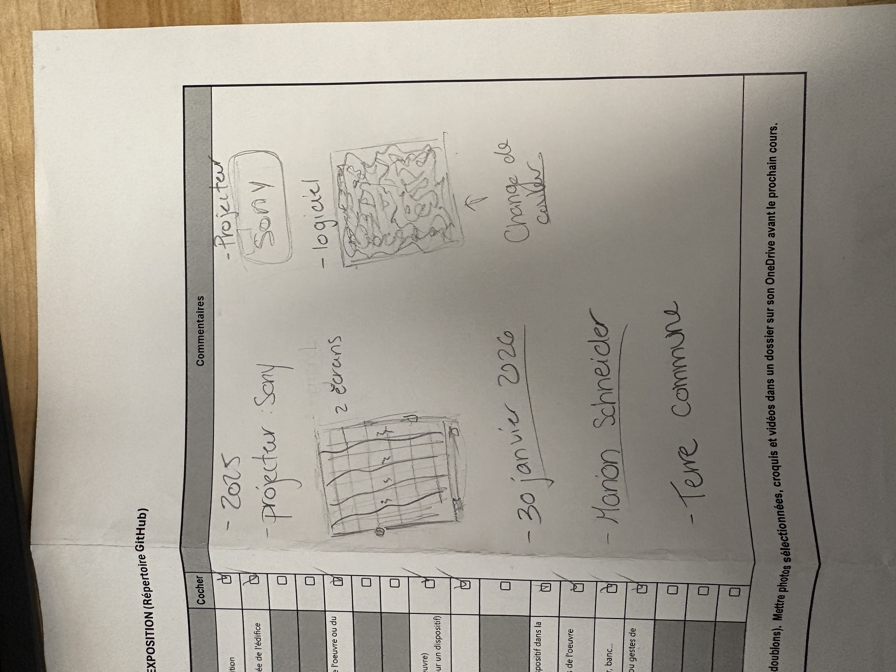

# La galerie UDM, l'intelligence IA mise à l'épreuve de l'art

## visite des oeuvres

 

>Moi ( Alicia Castilloux) devant la galerie de l’Université de Montréal, photo prise Ammar Mrini, 30 janvier 2026

Dès les premières minutes en franchissant les portes de la galerie de l’Université de Montréal à ce 30 janvier 2026, dédiée du 28 novembre 2025 au 26 février 2026 à la pratique de l’intelligence artificielle, nous sommes accueillis par l'affiche d'exposition, nous proposant un espace où l’art et la science se réunissent pour réveiller ce monde endormi et nous donner une nouvelle perspective de cette création.

 

>photo prise par Alicia Castilloux, 30 janvier 2026

Puis, nous sommes accueillis au cœur de cette exploration de la première exposition temporaire de la galerie, l'oeuvre de Marion Schneider, TERRE COMMUNE, 2025, une création assez perplexe et curieuse à ne pas passez devant et qui m'a piquer ma curiositée. 

  

>photo prise par Alicia Castilloux, 30 janvier 2026             >photo prise par Alicia Castilloux, 30 janvier 2026

 Sur la photo que j’ai prise, l’œuvre de Marion Schneider qui est à droite a une installation contemplative et interactive. Elle occupe presque tout le mur de la galerie avec une projection grandiose. Équipé d’un projecteur de la marque, Sony, une image étrange y est projetée. Composée de milliers de points et de nuances blanc, vert et noir, elle évoque les sols forestiers. Elle semble détendre, toujours en mouvement comme une transformation constante d’une dance sans fin.  

>photo prise par Alicia Castilloux, 30 janvier 2026

Au regard de l’exposition, c’est la présence de l’écran avec des lignes coloré à notre gauche de la présentation de l’œuvre qui est intriguant. Devant nous, un banc transparent est assisté et en dessous, un ordinateur qui nous aide pour l’expérience et une sorte de casque à mettre sur la tête (pour tester) est accompagner à l’expérience.  

 

>photo prise par Alicia Castilloux, 30 janvier 2026

De plus, l'œuvre devient  marquante lorsqu’on la visite à l’intérieur d’un édifice et c’est le cas pour tous les œuvres qui étaient présents à ce 30 janvier 2026, mais elle est plus intéressante quand nous pouvons interagir avec l’œuvre comme TERRE COMMUNE. L’interaction fonctionne quand le ou la visiteur·teuse doit s’asseoir sur le siège transparent, enfile le casque et regarde soit la projection devant soi ou soit l’écran coloré. À ce moment, ce n’est plus seulement une œuvre à observer, c’est une œuvre qui lit en nous. 

Sur l’écran apparaissent quatre lignes colorées qui traduisent notre état mental. Si l’on est calme, concentré·e, en contrôle, les lignes deviennent droites et stables. Mais quand notre esprit s’agite, elles se mettent à gigoter dans tous les sens. Donc, voir son propre calme ou son stress, elle se réalise en temps réel et ceci est une expérience fascinante à essayer et à découvrir. L’installation crée un dialogue direct entre notre cerveau, la machine et l’IA.

J’ai moi-même tenté l’expérience. Au début, mes lignes vibraient sans cesse. Puis, en me concentrant sur ma respiration et ma tête, j’ai vu les courbes se stabiliser progressivement en ligne droite.  Sur la photo que j’ai prise pendant l’installation, on distingue d’ailleurs ces lignes colorées tendues et presque parfaitement droites, preuve d’un instant de contrôle mais que même en prenant une photo cela est difficile. 

Selon moi, je n’aurais pas forcément utilisé des photos de paysages pour exploiter l’IA, mais plus pour une méthode plus complexe afin d’attirer davantage l’attention des visiteur·teuse·s qui tenteraient l’expérience, par exemple en intégrant des images humoristiques. Cette formule représenterait un défi pour les interacteur·trice·s, qui devra redoubler d’effort pour calmer leur esprit. 

 

>photo prise par Alicia Castilloux, 30 janvier 2026

Pour finir cette visite, voici un croquis de mon regard sur l'exposition pour capturer le moment présent de ce qui m'a éblouit de l'oeuvre.

 

>photo prise par Alicia Castilloux, 30 janvier 2026
